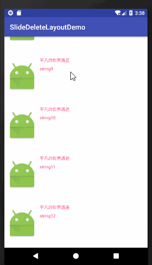

### 侧滑删除布局
参考自[SwipeDelMenuLayout](https://github.com/mcxtzhang/SwipeDelMenuLayout)



**使用方式:** 

    implementation 'com.hm.kof97:slidedeletelayout:1.0'

**recyclerview 布局文件**

   ```
 <?xml version="1.0" encoding="utf-8"?>

    <RelativeLayout
    xmlns:android="http://schemas.android.com/apk/res/android"
    android:layout_width="match_parent"
    android:layout_height="match_parent">
    
    <android.support.v7.widget.RecyclerView
    android:id="@+id/recycler_view"
    android:layout_width="match_parent"
    android:layout_height="match_parent"
    android:layout_centerHorizontal="true"/>
    
    </RelativeLayout>
```


**recyclerView item的布局文件**
```xml
<?xml version="1.0" encoding="utf-8"?>
<com.hm.slidedeletelayout.SlideDeleteLayout
    xmlns:android="http://schemas.android.com/apk/res/android"
    xmlns:app="http://schemas.android.com/apk/res-auto"
    android:layout_width="match_parent"
    android:layout_height="wrap_content"
    app:iosStyle="true"
    app:leftSlide="true"
    app:slideEnable="true">

    <RelativeLayout
        android:id="@+id/item_rl_content"
        android:layout_width="match_parent"
        android:layout_height="140dp"
        android:background="@android:color/white">

            <ImageView
                android:id="@+id/item_image_book"
                android:layout_width="70dp"
                android:layout_height="90dp"
                android:layout_centerVertical="true"
                android:layout_marginLeft="16dp"
                android:scaleType="centerCrop"
                android:src="@mipmap/ic_launcher"/>

            <RelativeLayout
                android:layout_width="match_parent"
                android:layout_height="match_parent"
                android:layout_marginLeft="16dp"
                android:layout_marginTop="16dp"
                android:layout_toRightOf="@+id/item_image_book">

                <TextView
                    android:id="@+id/item_text_book_name"
                    android:layout_width="match_parent"
                    android:layout_height="wrap_content"
                    android:layout_marginRight="14dp"
                    android:ellipsize="end"
                    android:gravity="left|center_vertical"
                    android:maxLines="1"
                    android:text="平凡的世界路遥"
                    android:textColor="@color/colorAccent"
                    android:textSize="12sp"/>

                <TextView
                    android:id="@+id/item_text_book_isbn"
                    android:layout_width="match_parent"
                    android:layout_height="wrap_content"
                    android:layout_below="@+id/item_text_book_name"
                    android:layout_marginRight="14dp"
                    android:layout_marginTop="8dp"
                    android:ellipsize="end"
                    android:gravity="left|center_vertical"
                    android:maxLines="1"
                    android:text="ISBN:100086"
                    android:textColor="@color/colorAccent"
                    android:textSize="12sp"/>

            </RelativeLayout>

    </RelativeLayout>

    <TextView
        android:id="@+id/item_text_remove"
        android:layout_width="80dp"
        android:layout_height="140dp"
        android:layout_toRightOf="@+id/item_ll_content"
        android:gravity="center"
        android:text="删除"
        android:background="@color/colorPrimary"
        android:textColor="@color/colorAccent"/>

</com.hm.slidedeletelayout.SlideDeleteLayout>
```
**自定义属性说明**

```
<!--是否可以通过滑动，显示删除菜单，默认true-->
<attr name="slideEnable" format="boolean"/>
<!--是否是ios方式的滑动方式,默认true-->
<attr name="iosStyle" format="boolean"/>
<!--标记是左滑还是右滑显示删除菜单，默认左滑显示删除菜单-->
<attr name="leftSlide" format="boolean"/>
```
**MainActivity代码**
```java
public class MainActivity extends AppCompatActivity {

    public static final String TAG = MainActivity.class.getSimpleName();
    private RecyclerView recyclerView;
    private List<String> stringList;
    private RvAdapter adapter;
    private LinearLayoutManager layoutManager;

    @Override
    protected void onCreate(Bundle savedInstanceState) {
        super.onCreate(savedInstanceState);
        setContentView(R.layout.activity_main);
        recyclerView = findViewById(R.id.recycler_view);
        stringList = new ArrayList<>();
        for (int i = 0; i < 30; i++) {
            stringList.add("string" + i);
        }
        adapter = new RvAdapter(this, stringList);
        adapter.setOnItemClickListener(new OnItemClickListener() {
            @Override
            public void onItemClick(View view, int position) {
                Toast.makeText(MainActivity.this, "position=" + position, Toast.LENGTH_SHORT).show();
            }
        });
        adapter.setOnItemDeleteListener(new OnItemDeleteListener() {
            @Override
            public void onItemDelete(int position) {
                stringList.remove(position);
                adapter.notifyItemRemoved(position);
            }
        });
        layoutManager = new LinearLayoutManager(this);
        recyclerView.setLayoutManager(layoutManager);
        recyclerView.setAdapter(adapter);
    }

    class RvAdapter extends RecyclerView.Adapter<RvAdapter.VH> {

        private Context context;
        private List<String> stringList;
        private OnItemClickListener onItemClickListener;
        private OnItemDeleteListener onItemDeleteListener;

        public void setOnItemClickListener(OnItemClickListener onItemClickListener) {
            this.onItemClickListener = onItemClickListener;
        }

        public void setOnItemDeleteListener(OnItemDeleteListener onItemDeleteListener) {
            this.onItemDeleteListener = onItemDeleteListener;
        }

        public RvAdapter(Context context, List<String> stringList) {
            this.context = context;
            this.stringList = stringList;
        }

        @Override
        public VH onCreateViewHolder(ViewGroup parent, int viewType) {
            View view = LayoutInflater.from(context).inflate(R.layout.item_slide_delete, parent, false);
            return new VH(view);
        }

        @Override
        public void onBindViewHolder(final VH holder, final int position) {
            if (onItemClickListener != null) {
                holder.itemRlContent.setOnClickListener(new View.OnClickListener() {
                    @Override
                    public void onClick(View v) {
                        Log.e(TAG, "onClick: position=" + position);
                        onItemClickListener.onItemClick(v, holder.getAdapterPosition());
                    }
                });
            }
            if (onItemDeleteListener != null) {
                holder.itemTextRemove.setOnClickListener(new View.OnClickListener() {
                    @Override
                    public void onClick(View v) {
                        onItemDeleteListener.onItemDelete(holder.getAdapterPosition());
                    }
                });
            }
            holder.itemImageBook.setImageResource(R.mipmap.ic_launcher);
            holder.itemTextBookIsbn.setText(stringList.get(position));
        }

        @Override
        public int getItemCount() {
            return stringList.size();
        }

        class VH extends RecyclerView.ViewHolder {

            private ImageView itemImageBook;
            private TextView itemTextBookName;
            private RelativeLayout itemRlContent;
            private TextView itemTextBookIsbn;
            private TextView itemTextRemove;

            public VH(View itemView) {
                super(itemView);
                itemImageBook = itemView.findViewById(R.id.item_image_book);
                itemTextBookName = itemView.findViewById(R.id.item_text_book_name);
                itemRlContent = itemView.findViewById(R.id.item_rl_content);
                itemTextBookIsbn = itemView.findViewById(R.id.item_text_book_isbn);
                itemTextRemove = itemView.findViewById(R.id.item_text_remove);
            }
        }
    }

    interface OnItemClickListener {
        void onItemClick(View view, int position);
    }

    interface OnItemDeleteListener {
        void onItemDelete(int position);
    }
}

```
  

    
    
    